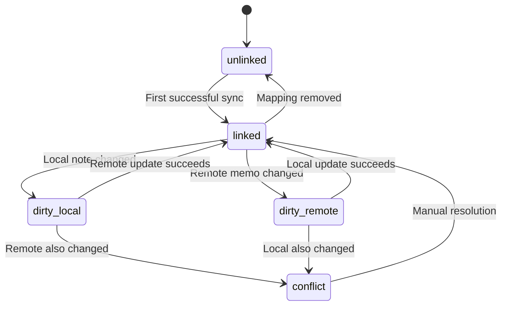

# Architecture

Overview of the Memos SP Plugin internal structure and data flow.

## Modules

- **adapters/memos-client**: Handles HTTP communication with the Memos REST API.
- **engine/sync-engine**: Computes sync actions between local plugin notes and remote memos.
- **types**: Defines local note, mapping, config, and sync log structures.
- **plugin host**: Owns local note storage, executes sync actions, and persists state.
- **ui panel**: Provides configuration, note editing, conflict resolution, and sync log views.

## State Machine

The sync engine tracks the relationship between a local plugin note and a remote memo.

## Storage Model

- **Local notes** are stored in plugin state and rendered only by the plugin panel.
- **Mappings** store the relationship between `localNoteId` and `memoId`.
- **Sync log** stores diagnostic entries and action results.
- **Plugin config** stores connection settings and sync tag.

## Data Flow

1. The user edits a local note in the plugin panel.
2. The plugin host stores the note in persisted plugin state.
3. `Sync Now` fetches tagged memos from Memos.
4. The sync engine compares local note snapshots, remote memo snapshots, and stored mappings.
5. The plugin host executes the returned actions.
6. Updated mappings and sync logs are written back to plugin storage.
